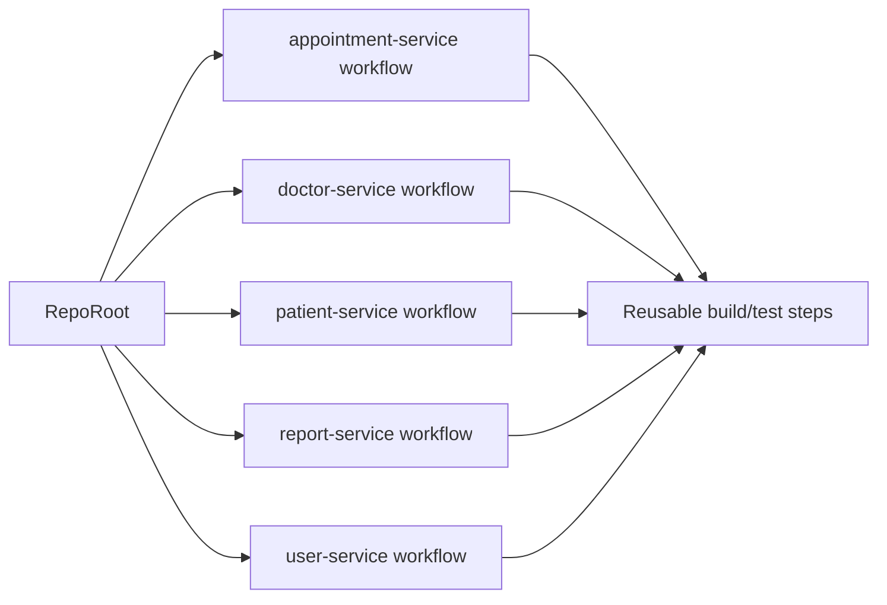
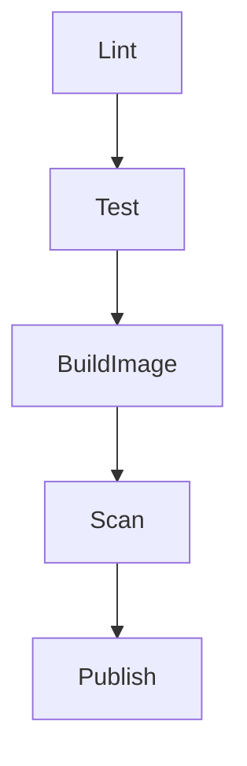

# Project Name: Microservices CI/CD with GitHub Actions

## Introduction to GitHub Actions
GitHub Actions is an integrated CI/CD automation system that runs workflow definitions stored in a repository. It automates software workflows by responding to repository events (push, pull_request, schedule, workflow_dispatch) and executing defined jobs on hosted or self-hosted runners. In modern DevOps, GitHub Actions orchestrates build, test, analysis, and publishing tasks, enabling repeatable pipelines and fast feedback loops directly inside the repository.

## Project Architecture Overview
This repository houses five distinct microservices. Replace the placeholders below with your actual service names when ready:

- appointment-service
- doctor-service
- patient-service
- report-service
- user-service

Each microservice operates independently but shares a unified CI/CD automation strategy implemented with GitHub Actions to ensure consistency, reproducibility, and efficient runner usage.

## GitHub Actions Workflow Configuration
This section describes the exact automation setup used for this project.

### Trigger Strategies
Workflows use event and path filtering to minimize unnecessary runs and to provide precise feedback for changes.

- Path-specific filters: workflows are configured so changes under a service folder trigger only that service's pipeline. Example:

```yaml
on:
  push:
    paths:
      - 'healthcare-microservices/appointment-service/**'
  pull_request:
    paths:
      - 'healthcare-microservices/appointment-service/**'
  workflow_dispatch: {}
```

- Branch/PR filters: workflows can further restrict runs to branches (for example, `main` for publishing) and can run for PRs against target branches.
- Manual trigger: `workflow_dispatch` enables manual runs from the Actions UI for ad-hoc testing.

### Monorepo Workflow Design
The repository uses a monorepo pattern with a consistent CI strategy across five services while avoiding duplication.

- Independent workflow files per service: each service has a dedicated workflow file under `.github/workflows/` so runs are isolated and permissions/secrets can be scoped.
- Reusable workflows and composite actions: shared build/test/publish logic is extracted into reusable workflows to reduce copy-paste and simplify updates.
- Matrix builds: where permutations are required (JDK versions, OS), matrix strategies are used to run variations in parallel.

Monorepo design (flowchart):



### Pipeline Stages
Each service pipeline follows a standard staged layout. Jobs are separated to allow parallel execution and clear dependency ordering.

- Linting and Static Code Analysis

	- Purpose: style, format, and static analysis checks (linters, static analyzers).
	- Implementation: a `lint` job that fails fast and prevents downstream work when checks break.

- Unit and Integration Testing

	- Purpose: run unit tests and short integration tests.
	- Implementation: a `test` job that depends on `lint`, uses dependency caching, and supports matrix permutations.

- Docker Image Building and Tagging

	- Purpose: produce container images for each service when configured.
	- Implementation: `build-image` job that builds and tags images using a stable tag strategy, for example `service:ci-${{ github.run_number }}` and `service:${{ github.sha }}`.

- Security Vulnerability Scanning

	- Purpose: scan dependencies and container images for known vulnerabilities.
	- Implementation: `scan` job that runs after image build (or after dependency resolution for language-level scans) using Trivy, Snyk, or similar scanning steps.

- Deployment/Publishing steps

	- Purpose: publish artifacts or push images to registries when runs are on protected branches and credentials are available.
	- Implementation: `publish` job that runs only on `push` to main (or a protected branch) and checks for secrets before publishing.

Pipeline flowchart (per-service):



Example job dependency YAML (abstracted):

```yaml
jobs:
	lint:
		runs-on: ubuntu-latest
		steps: ...

	test:
		needs: lint
		runs-on: ubuntu-latest
		steps: ...

	build-image:
		needs: test
		runs-on: ubuntu-latest
		steps: ...

	scan:
		needs: build-image
		runs-on: ubuntu-latest
		steps: ...

	publish:
		needs: scan
		if: github.event_name == 'push' && github.ref == 'refs/heads/main'
		runs-on: ubuntu-latest
		steps: ...
```

## Key Features of This Setup

- Path-filtering optimizes runner usage.
- Parallel job execution speeds up build and test feedback.
- Centralized secrets management (repository or environment secrets) secures credentials used for publishing and scanning.
- Reusable steps maintain DRY principles and simplify updates across services.

## How to Trigger and Run Workflows

- By pull request: open a PR that modifies files inside a service folder (for example `microservice-3/**`) — the related service workflow will run automatically.
- By push: pushing commits to a branch triggers the configured `push` rules and path filters.
- Manually: trigger any `workflow_dispatch`–enabled workflow from the repository Actions tab to run pipelines on demand.

Local testing: you can run the same commands used in workflow steps locally to validate logic, but hosted runner behavior (secrets injection, runner environment) will differ from local emulation tools.

---

Diagrams above show the monorepo layout and per-service pipeline flow. Replace placeholder service names with your real service folder names when customizing the workflows.

If you want, I can now scan `.github/workflows/` in this repository and draft per-service workflow files that match this README. Reply with `scan workflows` to proceed.

